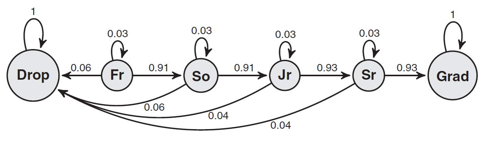

```{r setup, include=FALSE}
knitr::opts_chunk$set(echo = TRUE)

require(tidyverse)
library(latex2exp)
library(expm)

write_matrix <- function(x) {
  begin <- "\\begin{pmatrix}"
  end <- "\\end{pmatrix}"
  X <-
    apply(x, 1, function(x) {
      paste(
        paste(x, collapse = "&"),
        "\\\\"
      )
    })
  paste(c(begin, X, end), collapse = "")
}

library(cowplot)
theme_set(theme_cowplot())


markov <- function(init, mat, n, labels) { 
  if (missing(labels)) labels <- 1:length(init)
  
  simlist <- numeric(n+1)
  states <- 1:length(init)
  simlist[1] <- sample(states,1,prob=init)
  
  for(i in 2:(n+1)){ 
    simlist[i] <- sample(states,1,prob=mat[simlist[i-1],]) 
  }
  labels[simlist]
}

```

## American University Graduation Rates

An American University administrators have developed a Markov model to simulate graduation rates at their school. Students might drop out, repeat a year, or move on to the next year. Students have a 3% chance of repeating the year. First-years and sophomores have a 6% chance of dropping out. For juniors and seniors, the drop-out rate is 4%. The transition diagram for the model is 




Eventually, students will either drop out or graduate.

We can create the transition matrix for this Markov chain in `R` as follows

```{r, echo=TRUE}
# your code goes here
P <- matrix(
  # Drop  Fr    So    Jr    Se    Grad
  c(1.00, 0.00, 0.00, 0.00, 0.00, 0.00, # Drop  
    0.06, 0.03, 0.91, 0.00, 0.00, 0.00, # Fr    
    0.06, 0.00, 0.03, 0.91, 0.00, 0.00, # So  
    0.04, 0.00, 0.00, 0.03, 0.93, 0.00, # Jr
    0.04, 0.00, 0.00, 0.00, 0.03, 0.93, # Se
    0.00, 0.00, 0.00, 0.00, 0.00, 1.00  # Grad
    ), byrow=TRUE, ncol = 6, nrow = 6)
states <- c("Drop","Fr","So","Jr","Se","Grad")
rownames(P) <- states
colnames(P) <- states

P
```

* * *

### Excerise 1:

What is the probability that a student that starts in first year will graduate within first four year?

```{r}
alpha <- c(0,1,0,0,0,0)
names(alpha) <- states

library(expm)


X_4 <- t(alpha) %*% (P %^% 4)
X_4[6]

prob_grad <- tibble(years = 1:10, prob = NA)
for(i in 1:10){
  X_n <- t(alpha) %*% (P %^% i)
  prob_grad$prob[i] <- X_n[6]
}

ggplot(prob_grad, aes(x = years, y = prob)) + 
  geom_point() + geom_line()

```

* * *

### Excerise 2:

How would we estimate this probability via simulation?
 
```{r}


```
* * *

## The canonical decomposition

We can rearrange the transition matrix into it's canonical decomposition by change the ordering of the states in the transition matrix, starting with any transient states first and then having the absorbing states. Results in $\{Fr, So, Jr, Sr, Drop, Grad\}$.

This will result in in the following matrix:

```{r}

P_con <- matrix(
  # Fr    So    Jr    Sr    Drop  Grad
  c(0.03, 0.91, 0.00, 0.00, 0.06, 0.00, # Fr
    0.00, 0.03, 0.91, 0.00, 0.06, 0.00, # So
    0.00, 0.00, 0.03, 0.93, 0.04, 0.00, # Jr
    0.00, 0.00, 0.00, 0.03, 0.04, 0.93, # Sr
    0.00, 0.00, 0.00, 0.00, 1.00, 0.00, # Drop  
    0.00, 0.00, 0.00, 0.00, 0.00, 1.00  # Grad
    ), 
  byrow = TRUE, ncol = 6, nrow = 6)

states_con <- c("Fr", "So", "Jr", "Sr", "Drop", "Grad")
rownames(P_con) <- states_con
colnames(P_con) <- states_con

P_con
```
* * *

### Excerise 3

Starting in first year what is the expected number of visitors to the $Jr$ year state before either dropping out or graduating?


```{r}


```

* * *

### Excerise 4

What is the probability of graduating starting from the $Fr$ state.

```{r}


```
* * *

### Excerise 5

What is the expected time until absorption?

```{r}


```
* * *

### Excerise 6

Confirm this via simulation the last result via simulation. 

```{r}


```
* * *

### Excerise 7

What is the expected time to graduation given that someone **does** graduate starting from $Fr$ state?

```{r}


```